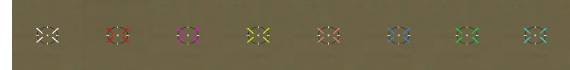

# HitMarker SA-MP

A lightweight, highly customizable hitmarker library for SA-MP



## Main features
* Customizable colors for different body parts and vehicles.
* Weapon exclusion: disable the marker for specific weapons (e.g., vehicle weapons).
* Audio feedback: play a sound on every successful hit.
* Fully adjustable: set custom position and size for the marker.

## Reference
* [Installation](#installation)
* [Example](#example)
* [Functions](#functions)
* [Definitions](#definitions)
  * [Color IDs](#color-ids)
  * [Weapon IDs](#weapon-ids)
  * [Change position](#change-position)

## Installation

Include in your code and begin using the library:
```pawn
#include <hitmarker>
```

## Example
<details>
<summary>Click to expand the list</summary>

```pawn
CMD:hitmarker(playerid) {

    if(!IsHitmarkerEnabled(playerid)) {

        HitmarkerEnable(playerid);

        // Setting the hit colors
        SetHitmarkerColor(playerid, HITMARKER_BODYPART_TORSO, 0xFFFFFFFF);
        SetHitmarkerColor(playerid, HITMARKER_BODYPART_GROIN, 0x7CFC00FF);
        SetHitmarkerColor(playerid, HITMARKER_BODYPART_LEFT_ARM, 0xFFA500FF);
        SetHitmarkerColor(playerid, HITMARKER_BODYPART_RIGHT_ARM, 0xFFD700FF);
        SetHitmarkerColor(playerid, HITMARKER_BODYPART_LEFT_LEG, 0x00BFFFFF);
        SetHitmarkerColor(playerid, HITMARKER_BODYPART_RIGHT_LEG, 0x00FFFFFF);
        SetHitmarkerColor(playerid, HITMARKER_BODYPART_HEAD, 0xFF00FFFF);

        SetHitmarkerColor(playerid, HITMARKER_COLOR_KILLSHOT, 0xFF0000FF);
        SetHitmarkerColor(playerid, HITMARKER_COLOR_VEHICLE, 0xB03060FF);

        ToggleHitmarkerVehicleDamage(playerid, true);

        ToggleHitmarkerWeapon(playerid, WEAPON_BAT, true);
        ToggleHitmarkerWeapon(playerid, HITMARKER_AIR_WEAPON_MINIGUN, true);

        GameTextForPlayer(playerid, "Hitmarker ~g~~h~On", 1200, 4);
    }
    else {
        HitmarkerDisable(playerid);
        GameTextForPlayer(playerid, "Hitmarker ~r~~h~Off", 1200, 4);
    }
    return 1;
}
```
</details>

## Functions
<details>
<summary>Click to expand the list</summary>

#### HitmarkerEnable(playerid)
> Enables the hitmarker for a player.
> * `playerid` - The ID of the player

#### HitmarkerDisable(playerid)
> Disables the hitmarker for a player.
> * `playerid` - The ID of the player
  
#### IsHitmarkerEnabled(playerid)
> Checks if the hitmarker is enabled.
> * `playerid` - The ID of the player
> * Return (true) if enabled or (false) if disabled
  
#### SetHitmarkerColor(playerid, type, color)
> Set hitmarker color
> * `playerid` - The ID of the player
> * `type` - [Color Ids](#color-ids)
> * `color` - The color to set. Supports alpha values.

#### GetHitmarkerColor(playerid, type)
> Get hitmarker color
> * `playerid` - The ID of the player
> * `type` - [Color Ids](#color-ids)
> * Returns the color

#### ToggleHitmarkerWeapon(playerid, weaponid, bool:toggle)
> Disable the hitmarker for a specific weapon
> * `playerid` - The ID of the player
> * `weaponid` - [Weapon IDs](#weapon-ids)
> * `toggle` - `true` to disable / `false` to enable
> * **Disabling certain firearms also affects associated weapons (IDs: 18, 37).**
> * **Disabling explosive weapons also affects associated weapons (IDs: 16, 35, 36, 39, 51). This rule does not apply to air transport.**

#### IsHitmarkerWeaponDisabled(playerid, weaponid)
> Get hitmarker status for a certain weapon
> * `playerid` - The ID of the player
> * `weaponid` - [Weapon IDs](#weapon-ids)
> * Return (true) if disabled or (false) if enabled

#### SetHitmarkerSoundDamage(playerid, soundid)
> Enable hit sound
> * `playerid` - The ID of the player
> * `soundid` - Sound IDs

#### GetHitmarkerSoundDamage(playerid)
> Get current hit sound
> * `playerid` - The ID of the player
> * Returns sound ID

#### SetHitmarkerPosition(playerid, crosshair_type, Float:x, Float:y, Float:sizeX, Float:sizeY)
> Set the marker position
> * `playerid` - The ID of the player
> * `crosshair_type` - [Change position](#change-position)
> * `Float:x` - The X (left/right) coordinate to create the textdraw at.
> * `Float:y` - The Y (up/down) coordinate to create the textdraw at.
> * `Float:sizeX` - Width
> * `Float:sizeY` - Height 

#### GetHitmarkerPosition(playerid, crosshair_type, &Float:x, &Float:y, &Float:sizeX, &Float:sizeY)
> Get current hitmarker position
> * `playerid` - The ID of the player
> * `crosshair_type` - [Change position](#change-position)
> * `&Float:x` - The X (left/right) coordinate
> * `&Float:y` - The Y (up/down) coordinate
> * `&Float:sizeX` - Width
> * `&Float:sizeY` - Height 

#### ToggleHitmarkerPlayerDamage(playerid, bool:toggle)
> Enable player damage indication
> * `playerid` - The ID of the player
> * `toggle` - `true` to enable / `false` to disable
> * Enabled by default.

#### IsHitmarkerPlayerDamageEnabled(playerid)
> Get player damage status
> * `playerid` - The ID of the player
> * Return (true) if enabled or (false) if disabled

#### ToggleHitmarkerVehicleDamage(playerid, bool:toggle)
> Enable vehicle damage indication
> * `playerid` - The ID of the player
> * `toggle` - `true` to enable / `false` to disable

#### IsHitmarkerVehicleDamageEnabled(playerid)
> Get vehicle damage status
> * `playerid` - The ID of the player
> * Return (true) if enabled or (false) if disabled
</details>

## Definitions

#### Color IDs
<details>
<summary>Click to expand the list</summary>

| Definition                    | ID | Notes |
| ----------------------------- | -- | ---------------------------- |
| HITMARKER_COLOR_KILLSHOT      | 0  | The player died              |
| HITMARKER_COLOR_VEHICLE       | 1  | Vehicle damage dealt.        |  
| HITMARKER_BODYPART_TORSO      | 3  | Hit on the torso             |
| HITMARKER_BODYPART_GROIN      | 4  | Hit in the groin             |
| HITMARKER_BODYPART_LEFT_ARM   | 5  | Hit on the left arm          |
| HITMARKER_BODYPART_RIGHT_ARM  | 6  | Hit on the right arm         |
| HITMARKER_BODYPART_LEFT_LEG   | 7  | Hit on the left leg          |
| HITMARKER_BODYPART_RIGHT_LEG  | 8  | Hit on the right leg         |
| HITMARKER_BODYPART_HEAD       | 9  | Headshot hit                 |

##### Usage

```pawn
SetHitmarkerColor(playerid, HITMARKER_BODYPART_TORSO, 0xFFFFFFFF);
```

</details>

#### Weapon IDs
<details>
<summary>Click to expand the list</summary>

| Icon                                                                      | Definition                            | ID | Notes                                       | 
| ------------------------------------------------------------------------- | ------------------------------------- | -- | --------------------------------------------|
|        | HITMARKER_WEAPON_FIST                 | 0  | Damage received by fist                     |
|  | HITMARKER_WEAPON_VEHICLE_CRUSH        | 50 | Death by vehicle crush or helicopter blades |
|   | HITMARKER_ALL_EXPLOSION               | 51 | Death by explosion                          |
|          | HITMARKER_AIR_WEAPON_MINIGUN          | 52 | Death from vehicle-mounted machine guns     |
|   | HITMARKER_AIR_WEAPON_ROCKETS          | 53 | Death from vehicle-mounted rockets          |

##### Usage

```pawn
ToggleHitmarkerWeapon(playerid, HITMARKER_AIR_WEAPON_MINIGUN, true);
```
</details>

#### Change position
<details>
<summary>Click to expand the list</summary>

| Definition                    | ID  | Notes                                                                       |
| ----------------------------- | --- | --------------------------------------------------------------------------- |
| HITMARKER_POS_STANDARD        | 0   | Set standard position<br />**Used for firearms (ID: 22 - 33, 37 - 38)**     |
| HITMARKER_POS_CENTER          | 1   | Set the center position<br />**Used for melee weapons and vehicles**        | 

##### Usage
```pawn
SetHitmarkerPosition(playerid, HITMARKER_POS_STANDARD, 332.5, 172.5, 0.33, 0.7);
```
</details>

#### Other
<details>
<summary>Click to expand the list</summary>

```pawn
#define HITMARKER_VISIBLE_TIME 400
#define HITMARKER_TICK_RATE 400 
#define HITMARKER_DEFAULT_COLOR 0xFFFFFFFF
```
</details>